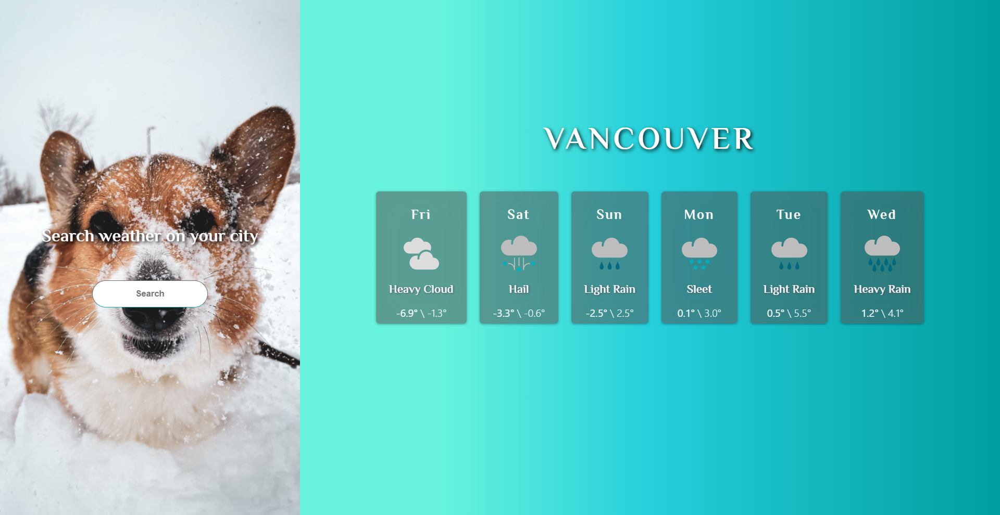
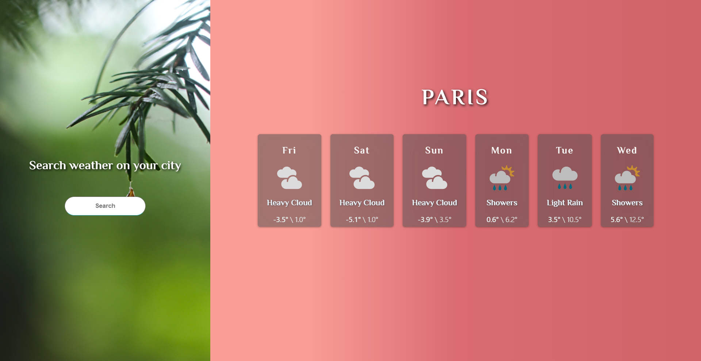
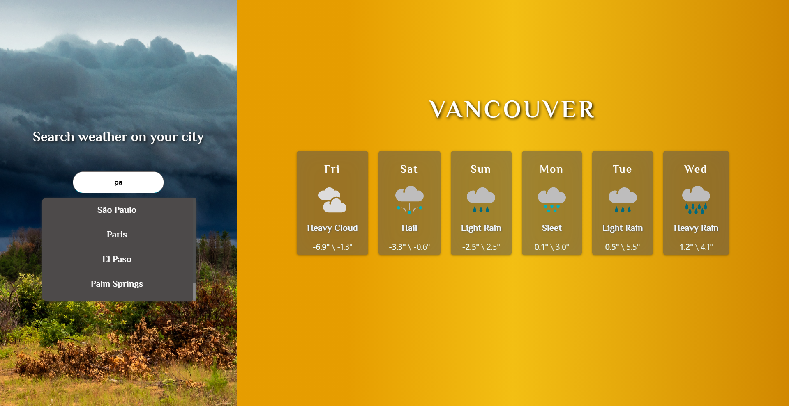

# Weather 

 

## Use 
this is simple weather app thats show you 6 days fore cast and you will see the minimum temputer of this day from left and maxium of the day from the right of the card , and desccrption and logo for the day.

#Backgrounds

backgrounds always change according to what ever card you hover.
every weather has a specific background to left of screen that will be shown when you hover the card.
and there is 3 difrent backgrounds for cards thats will change according to card's weather.

#Searching
 you can search for your city in the search box , you can add one letter or more and it will fond your as a options.
 
 just click a city options to go to that city.

# how to Run 

1. `First clone the repository`

2. `cd <project folder>`

3. use this script's to install the packages `npm install` or `yarn`

4. use this script's to run the app `npm start` or `yarn start`

#### This is the website used for rest api [click me](https://www.metaweather.com/api/).
